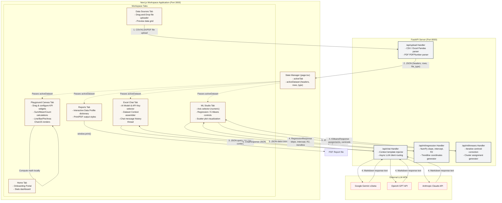

# ASync — Advanced AI Data Analyst Workspace

**ASync** is a premium, high-performance, stateless data analytics workspace. It enables users to connect business documents (Excel spreadsheets, CSVs, PDFs), visualize custom KPI graphs on an interactive canvas, run machine learning algorithms, and ask questions about their datasets using state-of-the-art LLMs (Gemini, GPT, Claude).

---

## 🚀 Key Features

* **Instant Document Parser**: Upload CSV, XLSX, XLS, and PDF files. The backend extracts structural columns, numbers, and text in milliseconds.
* **Playground Canvas**: Build dynamic visual widget dashboards (Line, Bar, Area, and Pie charts) and KPI summaries (Sum, Mean, Count) on a clean, responsive layout.
* **ML Studio**: Execute core machine learning models—specifically **linear regression** (slope, intercept, $R^2$ trendlines) and **K-Means clustering** (centroid mapping and group assignments) on custom data axes.
* **Excel Chat**: Talk to your files using Google Gemini, OpenAI GPT, or Anthropic Claude. The system bundles the dataset preview directly into the context window for natural language queries.
* **Analytical Reports**: Generate export-ready profiling summaries of connected attributes, values, and notes, with print-optimized CSS for PDF export.

---

## 🛠️ System Architecture

ASync uses a lightweight, decoupled web architecture:



* **Frontend**: Built using Next.js, React, ChartJS, TailwindCSS, and Axios. Source files are located in [frontend/src/app](file:///Users/arnavmehta/Desktop/ASync/frontend/src/app) and [frontend/src/components](file:///Users/arnavmehta/Desktop/ASync/frontend/src/components).
* **Backend**: A standalone, stateless FastAPI server driven by Pandas, NumPy, and PDFPlumber. Source code is located in [backend/app.py](file:///Users/arnavmehta/Desktop/ASync/backend/app.py).

---

## 📈 Current Progress & Project Status

### Completed Integrations
* **100% Frontend Implementation**: Home page, interactive sidebar navigation, drag-and-drop file uploaders, canvas dashboard widget configuration, chat thread bubbles, and scatter plot matrices are completely built.
* **100% API Coverage**: The backend script [app.py](file:///Users/arnavmehta/Desktop/ASync/backend/app.py) successfully exposes all 4 critical endpoints required by the Next.js frontend:
  * `POST /api/upload` (Extracts tabular data or PDF text)
  * `POST /api/chat` (Forwards prompts to Gemini, Claude, or GPT)
  * `POST /api/ml/regression` (Linear regression math)
  * `POST /api/ml/kmeans` (Clustering algorithm)

### Ongoing Improvements & Gaps
* **Datetime/Timestamp Formatting**: Handling date/time values parsed from Excel so that they serialize to JSON properly.
* **xls Legacy Format Support**: Adding `xlrd` to backend dependencies for old spreadsheet compatibility.

---

## ⚙️ Running Locally

Follow these instructions to spin up the local development environment:

### 1. Start the FastAPI Backend
Ensure Python 3.10+ is installed on your machine.
```bash
cd backend
pip install -r requirements.txt
python app.py
```
*The API will start running at `http://127.0.0.1:8000`.*

### 2. Start the Next.js Frontend
Ensure Node.js 18+ is installed on your machine.
```bash
cd frontend
npm install
npm run dev
```
*The interface will start running at `http://localhost:3000`.*

---

## 🔑 Credentials Configuration

API keys can be supplied in two ways:
1. **Frontend (Recommended)**: Click **API Credentials** in the sidebar to save keys (`localStorage`) locally in your browser. They will be passed to the backend per request.
2. **Backend Environment**: Set variables on your backend environment:
   * `GEMINI_API_KEY`
   * `OPENAI_API_KEY`
   * `ANTHROPIC_API_KEY`
